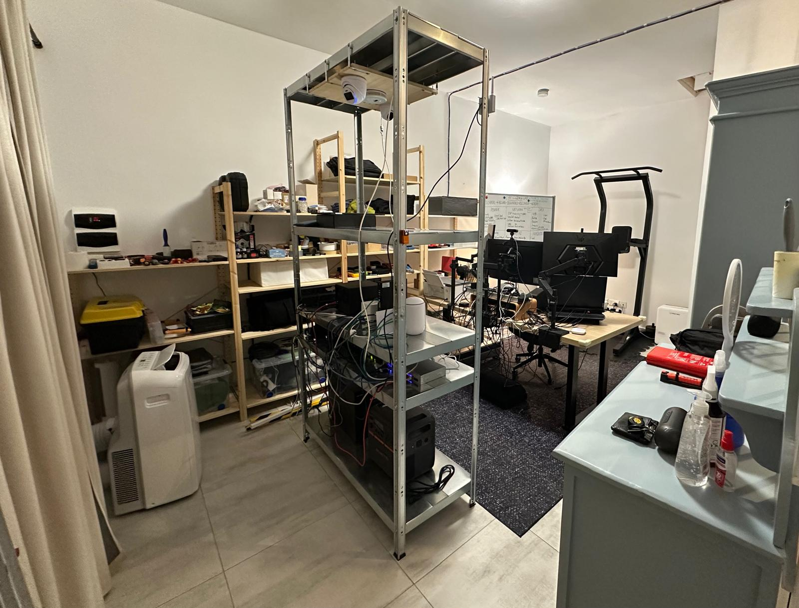
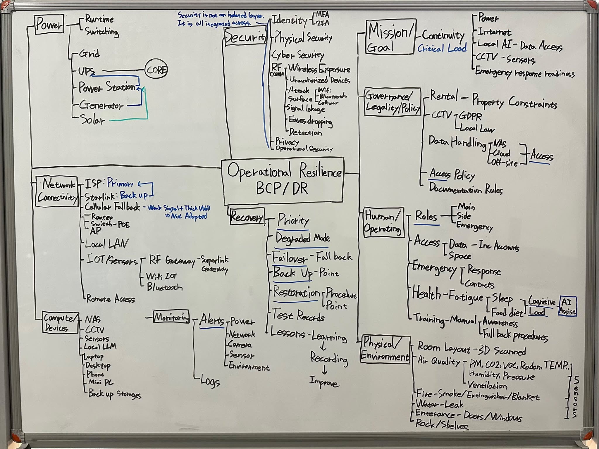

# Operational Resilience Lab

Most home labs are built to stay online.

I built this one to find out how it fails, what keeps working, and whether recovery can actually be verified.

This is a home lab I built on Gozo, a small Mediterranean island. It covers infrastructure, networking, power, physical safety, environmental monitoring, and recovery.

The physical baseline is in place, but the system is still a work in progress. Starlink failover remains unresolved. The X-Sense sensor deployment is still offline. Solar input has been observed, but the full generator-to-battery-to-UPS chain has not yet been tested.

I document what worked, what failed, and what still needs testing.

## Operating model

NORMAL -> FAILURE -> DEGRADED -> RECOVER -> VERIFY

## Operational resilience map

This is the current working model I use to map the lab beyond individual devices and projects.

The model looks at resilience across:

- Mission & Critical Functions
- Governance, Legal & Policy
- Human & Operational Factors
- Physical & Environmental Factors
- Power
- Network & Connectivity
- Compute, Storage & Devices
- Monitoring & Detection
- Recovery & Continuity

Security is not an isolated layer. It is a cross-cutting requirement integrated across the entire system, including physical security, cybersecurity, identity and access security, communications and RF security, privacy and exposure control, and operational security.

This is a working map rather than a finished architecture. It will continue to evolve as assumptions are tested, failures are observed, and recovery paths are verified.

## Projects

### [Project 000: The Baseline](project-000-baseline/README.md)

Before testing failover and recovery, I needed a physical environment I could work in, inspect, and maintain.

This project covers the room conversion, equipment layout, cable routing, environmental controls, and initial safety preparations.

Further project records will be added as they are prepared for publication.
