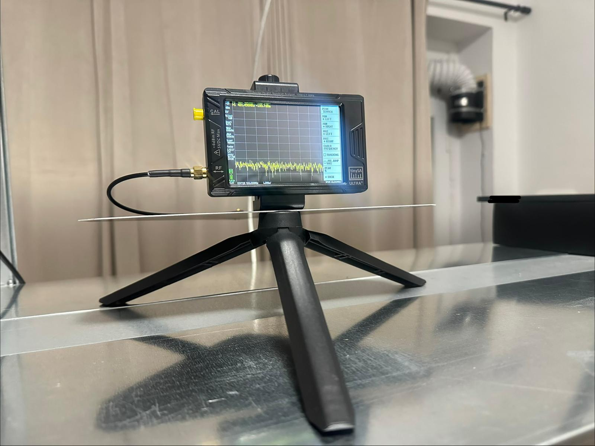
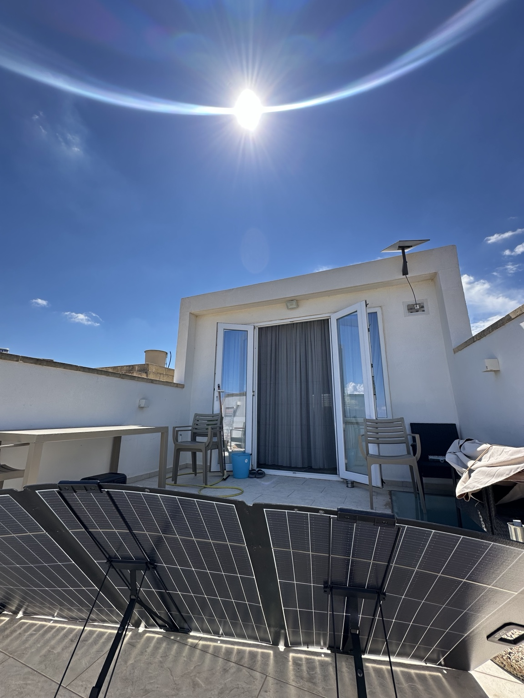
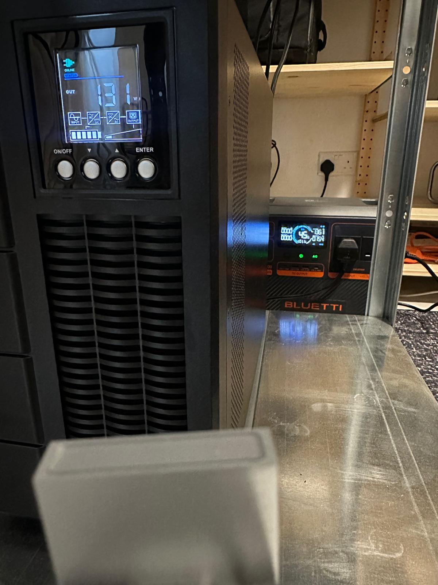

# Operational Resilience Lab

Most home labs are built to stay online.

I built this one to find out how it fails, what keeps working, and whether recovery can actually be verified.

This is a home lab I built on Gozo, a small Mediterranean island. It covers infrastructure, networking, power, physical safety, environmental monitoring, and recovery.

The physical baseline is in place, but the system is still a work in progress. Starlink failover remains unresolved. The X-Sense sensor deployment is not yet online. Solar input has been observed, and UPS grid-loss and manual source-transfer tests have been completed. The full generator-supported power chain has not yet been validated.

I document what worked, what failed, and what still needs testing.

## Verified so far

- [UPS grid-loss and recovery test](project-003-power-continuity/docs/03-power-continuity-tests.md): 129/129 LAN ping replies, 0% packet loss on the tested path.
- [Manual UPS source transfer from grid to BLUETTI](project-003-power-continuity/docs/03-power-continuity-tests.md): 217/217 LAN ping replies, 0% packet loss on the tested path.
- [Starlink standalone and secondary-WAN attempt](project-002-network-failure-recovery/docs/02-starlink-wan-attempt.md): direct Ethernet Internet access worked, but UDR7 secondary-WAN failover remains unresolved.

## Lab snapshots

<table>
<tr>
<td width="50%">

 RF measurement around the lab infrastructure
</td>
<td width="50%">

 Primary and secondary WAN state during network testing
</td>
</tr>
<tr>
<td width="50%">

 Portable solar input used for the power-continuity work
</td>
<td width="50%">

 Thermal observation during the initial power tests
</td>
</tr>
</table>

## Operating model

NORMAL -> FAILURE -> DEGRADED -> RECOVER -> VERIFY

## Operational resilience map

This is the current working model I use to map the lab beyond individual devices and projects.

The model looks at resilience across:

- Mission & Critical Functions
- Governance, Legal & Policy
- Human & Operational Factors
- Physical & Environmental Factors
- Power
- Network & Connectivity
- Compute, Storage & Devices
- Monitoring & Detection
- Recovery & Continuity

Security is not an isolated layer. It is a cross-cutting requirement integrated across the entire system, including physical security, cybersecurity, identity and access security, communications and RF security, privacy and exposure control, and operational security.

This is a working map rather than a finished architecture. It will continue to evolve as assumptions are tested, failures are observed, and recovery paths are verified.

## Projects

### [Project 000: The Baseline](project-000-baseline/README.md)

Before testing failover and recovery, I needed a physical environment I could work in, inspect, and maintain.

This project covers the room conversion, equipment layout, cable routing, environmental controls, and initial safety preparations.

Additional baseline records will be added as they are prepared for publication.

### [Project 001: Wireless, Cellular & RF](project-001-wireless-cellular-rf/README.md)

This project records connectivity observations across the available wireless and internet paths, including standalone connection behavior and the conditions under which each path is usable.

It provides the connectivity baseline that later network-failure and failover tests depend on.

### [Project 002: Network Failure & Recovery](project-002-network-failure-recovery/README.md)

This project tests what happens when the network fails or restarts, and separates local reachability, service recovery, WAN availability and backup-path usability.

It also records the unresolved Starlink secondary-WAN integration and the difference between a working standalone connection and a validated router-level failover path.

### [Project 003: Multi-Source Power Continuity](project-003-power-continuity/README.md)

This project tests how the lab behaves across power-source transitions, including UPS battery operation, manual source transfer and staged backup-power testing.

Solar charging observations, UPS grid-loss recovery and manual transfer to BLUETTI have been recorded. Generator-supported continuity and full critical-load runtime remain unvalidated.

  

UPS state recorded before the manual grid-to-BLUETTI source-transfer test

