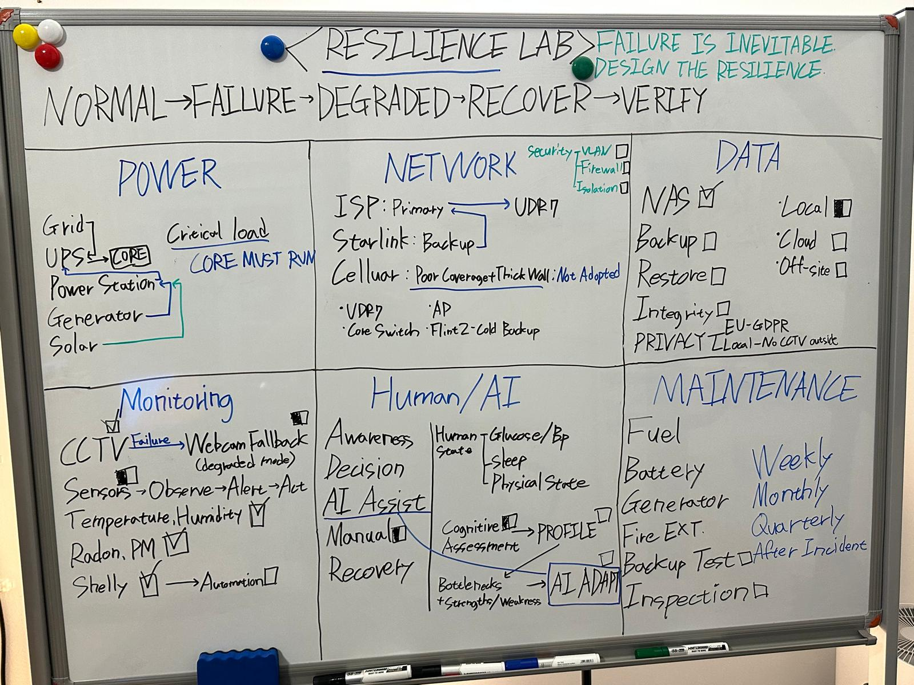
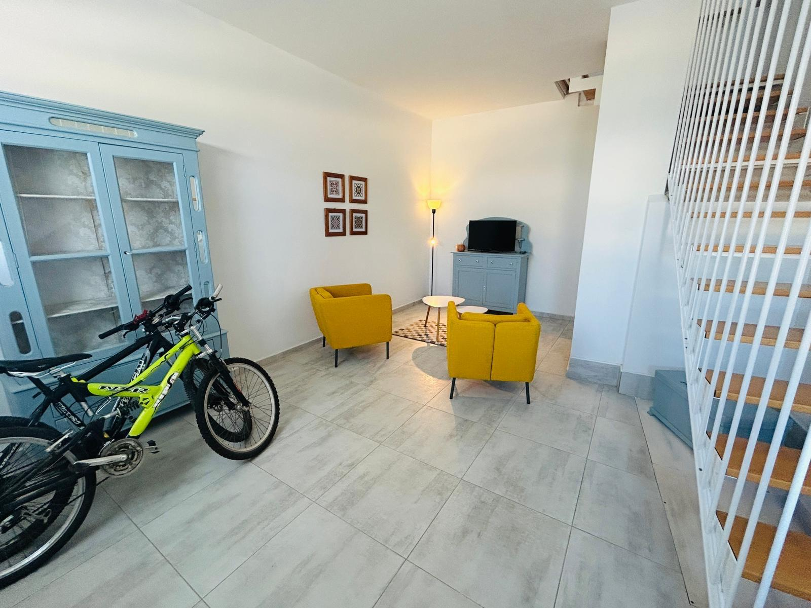

# Project 000: The Baseline

Most home labs start with servers. Mine started with the room.

I wanted to build a resilience lab at home, but a collection of devices is not a resilient system. Before testing network failover, backup power, or recovery procedures, I needed a space that I could move through safely, cool, inspect, maintain, and recover.



That led to a simple operating model:

```text
NORMAL -> FAILURE -> DEGRADED -> RECOVER -> VERIFY
```

Project 000 is the physical and operational baseline for the projects that follow. It covers the room, access, cable routing, environmental control, basic safety readiness, maintenance access, and the difference between equipment being present and a control actually working.

It is not a finished-lab announcement. Some controls are working, some are only partially verified, and one sensor deployment remains unresolved.

## Background

I did not come from a formal infrastructure or computer science background. I studied fashion and later completed a bachelor's degree in business, so much of this was new to me at first: networking, power systems, tools, cables, connectors, sensors, and equipment layout.

The learning was practical. I measured parts with a digital caliper and tape measure, checked power with a USB power meter, photographed changes, read documentation, and used AI when I needed help identifying equipment or challenging my assumptions.

At first, I mostly wanted to know whether something worked and how it worked. The question gradually changed:

> What happens when it does not work, and what actually needs to keep running?

I also had wrist surgery approaching, so I wanted the physical work to reach a usable baseline before recovery made cutting, drilling, lifting, and cable work more difficult.

## Before and current state

The room began as an ordinary living space.



It now functions as a small working lab with an open equipment frame, workstation, storage, environmental equipment, monitoring devices, and access to tools.


The current photograph is intentionally a real operating state. Cable organization around the desk is still being improved, the equipment frame remains open, and later controls are not presented as complete.

## What changed

- Converted the room into a dedicated technical workspace.
- Built an accessible equipment and storage layout.
- Enclosed and marked a cable crossing through the walking route.
- Added motion lighting for low-light access.
- Created an airflow path for portable cooling and dehumidification.
- Established a manual monitoring and remote-control path for environmental equipment.
- Positioned fire-response and First Aid equipment within the wider home layout.
- Terminated and performed a basic continuity check on a long Ethernet cable.
- Recorded the unsuccessful X-Sense deployment instead of treating local acknowledgement as operational success.

## Current status

| Area | Status | Current position |
|---|---|---|
| Room and equipment layout | Baseline established | Usable working environment; organization continues |
| Floor cable crossing | Completed | Enclosed and marked |
| Motion lighting | Installed | A repeatable off-to-on test is still needed |
| Environmental control | Partial | Monitoring and remote switching exist; decisions remain manual |
| Fire and First Aid readiness | Partial | Equipment is positioned; detailed inspection records are separate work |
| Ethernet cable | Basic check completed | Continuity tester used; not a category-certification result |
| X-Sense deployment | Unresolved and deferred | Local addition did not become a working application-level connection |

## Supporting records

The detailed work is separated so the baseline remains readable:

- [Physical build and access](docs/01-physical-build.md)
- [Environmental monitoring and control](docs/02-environmental-control.md)
- [Fire and First Aid readiness](docs/03-safety-readiness.md)
- [Ethernet cable build and basic check](docs/04-ethernet-cable-check.md)
- [X-Sense registration failure log](docs/05-xsense-failure-log.md)

These records will continue to develop as measurements, close-up inspection records, and repeatable tests are added. The status table above changes only when the supporting work changes.

## What comes next

Project 000 provides the physical and operational baseline for the later projects.

- Project 001 focuses on wireless, cellular, and RF observations.
- Project 002 focuses on network failure, recovery, and backup-path validation.
- Project 003 focuses on multi-source power continuity and recovery.

The next stage is not to make the room look finished. It is to test failure, degraded operation, recovery, and verification one system at a time.

Failure is inevitable. Design the resilience.

