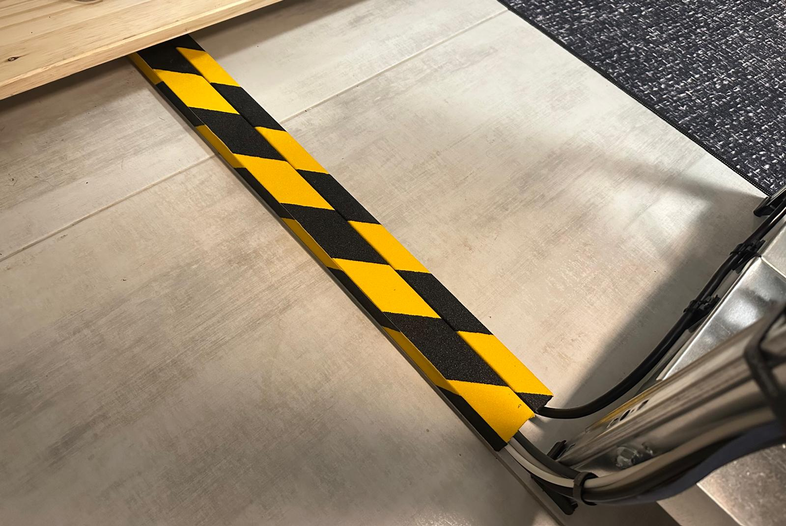
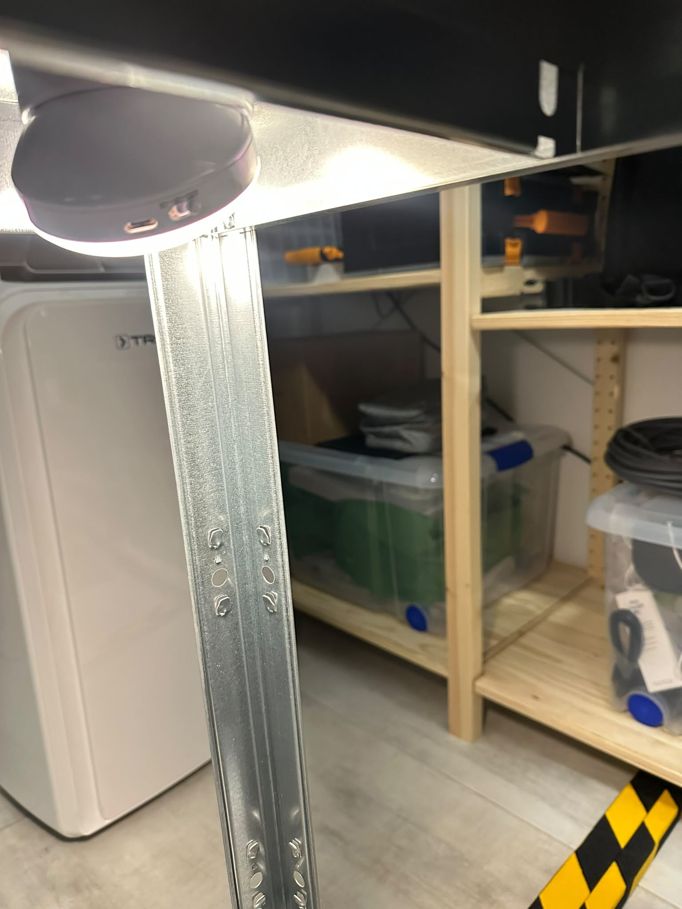

# Physical build and access

[Back to Project 000](../README.md)

The first part of Project 000 was making the room usable for repeated technical work. I needed clear access to the equipment, somewhere to store tools and spares, and a safer way to handle cables crossing a walking route.

## Room conversion

The room changed from a general living space into a dedicated workspace with:

- An open equipment frame
- A separate workstation
- Shelving for tools, spares, and maintenance items
- Portable cooling and dehumidification equipment
- Monitoring devices
- Enough access to inspect and change the equipment without dismantling the room

The open-frame layout makes inspection and modification easier while the lab is still changing. It also means cable organization and protection remain active maintenance tasks.

## Floor cable route

A long cable route crossed part of the walking path. I enclosed the crossing in floor trunking and added black/yellow high-visibility marking.

The purpose was practical: keep the cable in a defined route, reduce movement, and make the crossing easier to see. This was a home-lab mitigation rather than a formal workplace or building-safety assessment.

## Low-light access

I installed a motion light near the same route so the crossing and the approach to the equipment are visible in low light.

[Watch the low-light walkthrough](../media/videos/motion-light-walkthrough.mp4)

The current clip records the illuminated route during a walkthrough. A future test will start in darkness and record activation distance, delay, and timeout in one continuous take.

## Current position

The room is usable as a working baseline. The floor crossing is enclosed and marked, and the motion light is installed. Desk-side cable organization and protection around exposed equipment corners remain open improvements.

