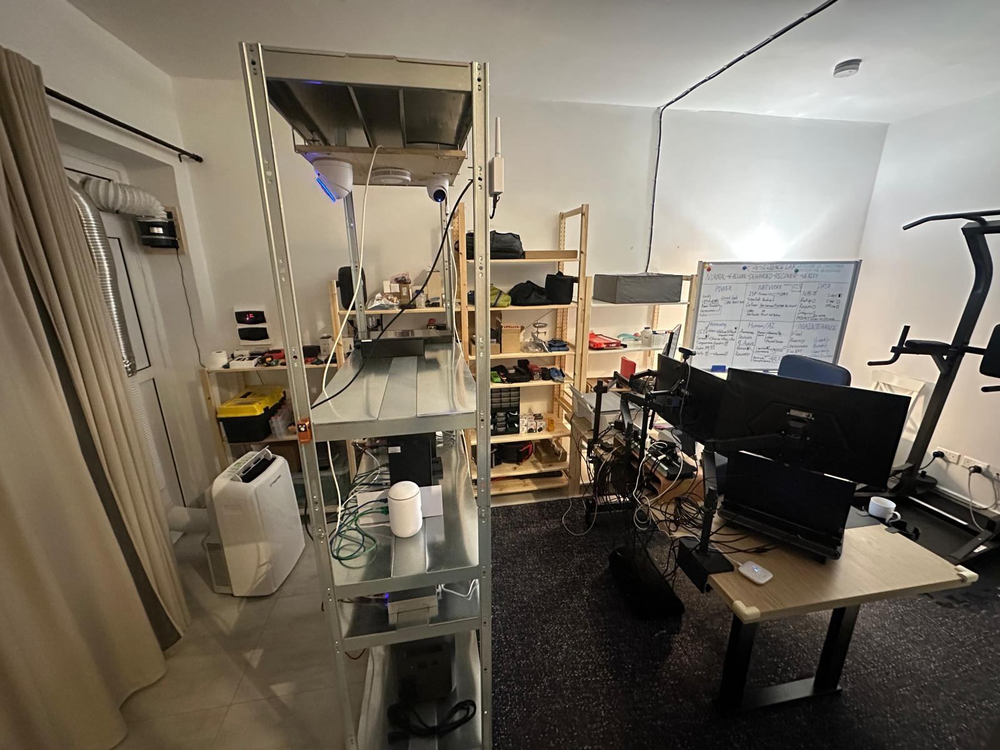
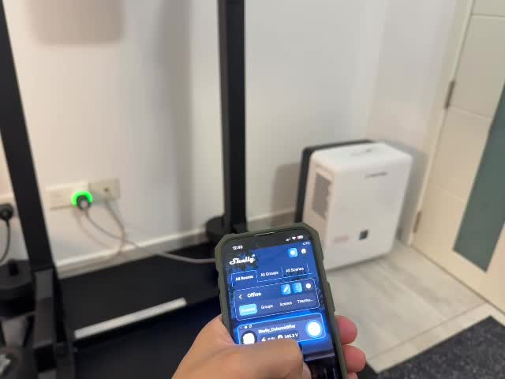

# Environmental monitoring and control

[Back to Project 000](../README.md)

Gozo's humidity made environmental control part of the infrastructure rather than a comfort-only issue. The current setup combines observation, a portable cooling/dehumidification unit, a modified window panel, and remote power control.



## Current operating path

```text
Airthings observation
        -> phone alert
        -> human decision
        -> Shelly command
        -> Trotec power path
```

This is currently a human-in-the-loop process. I review the condition and decide whether to switch the connected equipment. It is not yet closed-loop humidity automation.

## Remote switching

The Shelly-controlled path lets me change the connected plug state remotely.



[Watch the remote-control clip](../media/videos/shelly-remote-control.mp4)

The clip shows the command in the application and the plug indicator changing state. Device startup, electrical load, airflow, and room response will be covered in a separate measured test rather than inferred from the control screen.

## Power restoration behavior

During an earlier practical check, the Trotec unit restarted after a short power interruption while set to continuous mode. I recorded the observation in the project notes, but the detailed test still needs to be repeated with a visible timer, operating-state confirmation, and power measurement.

Until that record is complete, the restart result remains a working baseline rather than a published performance test.

## Next measurements

- Starting temperature and relative humidity
- Exact command and startup times
- Plug state and measured power draw
- Fan and compressor state
- Humidity readings at fixed intervals
- Behavior after power loss and restoration
- Behavior after simplifying the temporary adapter chain

The purpose of this record is to separate remote control from actual environmental performance. Switching a plug is one layer; changing the room condition reliably is another.

