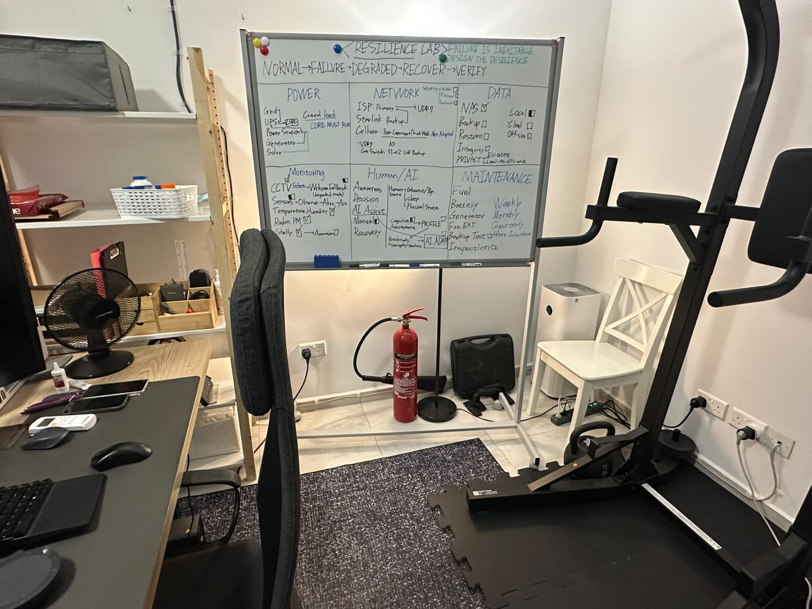
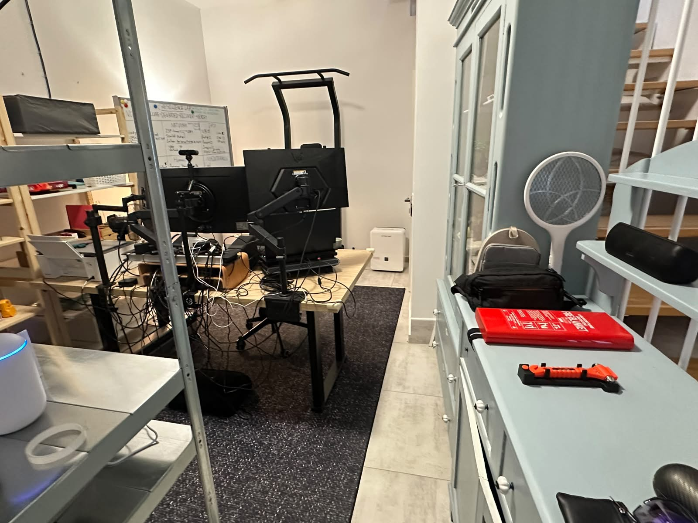
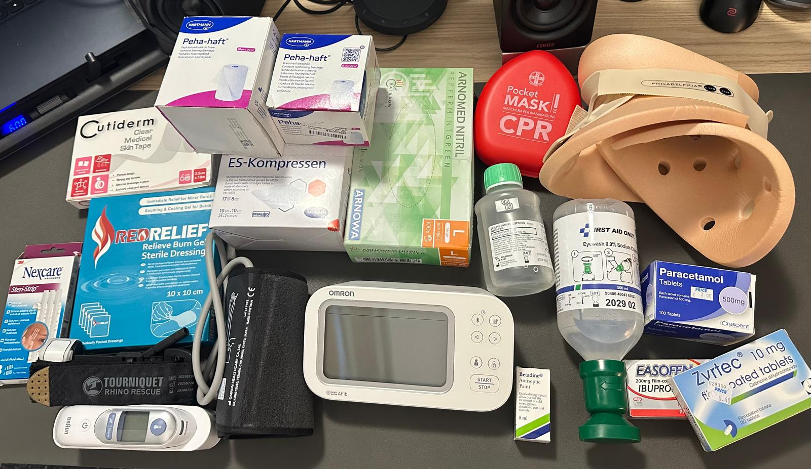
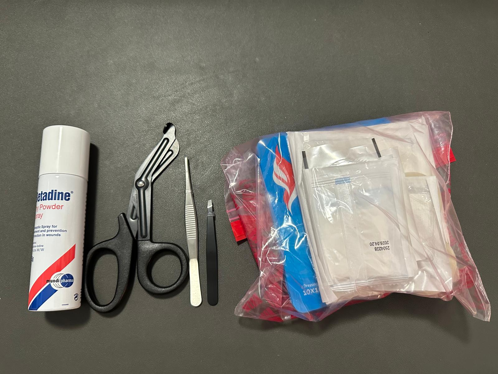

# Fire and First Aid readiness

[Back to Project 000](../README.md)

Project 000 includes basic response readiness around the lab. The goal at this stage was to position equipment where it could be reached without moving deeper into a possible hazard, then build separate inspection records for each item.

## Fire response layout

A 5 kg CO2 extinguisher is positioned in the ground-floor office, within an approximate 5 m walking route from the equipment area.

The wider home inventory also includes smaller extinguishers on the upper floors. Product labels, ratings, service information, and seal condition belong in the dedicated extinguisher inspection record rather than in the Project 000 overview.

## Fire blankets

Three fire blankets are allocated across the home. The rack-area blanket is positioned on an accessible cabinet surface near the lab.

The rack-area blanket is 1.2 m x 1.8 m. The other two blankets are 1 m x 1 m and are assigned to the bedroom and kitchen areas. Final placement photographs and periodic inspection will be maintained in the separate safety record.

## First Aid

The First Aid setup is broader than a small box of plasters. It combines wound care, basic response equipment, monitoring devices, and common non-prescription medicines.

The current inventory includes:

- Sterile gauze and compresses
- Cohesive bandages and medical skin tape
- Wound-closure strips
- Burn gel dressings
- Antiseptic
- Nitrile examination gloves
- Trauma or utility shears and tweezers
- A tourniquet
- A CPR pocket mask
- A cervical collar
- A digital blood-pressure monitor
- A digital thermometer
- Sterile 0.9% sodium-chloride eyewash
- Nasal or sinus-rinse solution
- Common non-prescription medicines, including paracetamol, ibuprofen, and cetirizine for allergies

The medicines are documented only as part of the inventory, not as prescribing or dosing guidance. I assembled and organized the kit based on what I learned through Malta Red Cross Basic First Aid training, and this record contains no personal medical information. The next documentation step is a structured check covering quantity, expiry, sealed or opened condition, storage location, and replenishment needs.

## Current position

Response equipment has been positioned and the main First Aid categories have been recorded. Detailed extinguisher inspection, final blanket placement records, and the First Aid expiry audit remain separate ongoing work. Ownership or placement alone is not treated as proof that every readiness check is complete.
