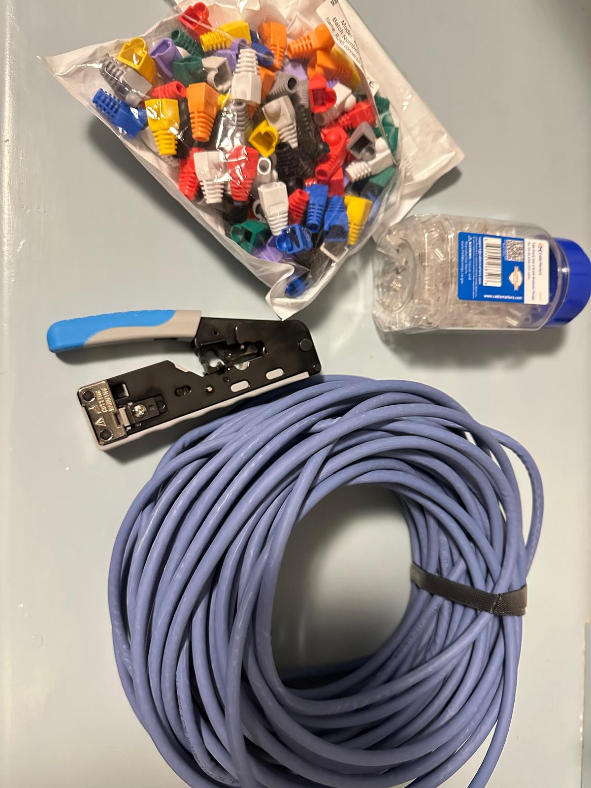

# Ethernet cable build and basic check

[Back to Project 000](../README.md)

I built and terminated a long Ethernet cable as part of preparing the physical network path.

The work involved measuring the route, cutting the cable, preparing the conductors, fitting the connectors, crimping both ends, and running a basic main/remote tester.

[Watch the continuity-tester clip](../media/videos/ethernet-continuity-check.mp4)

The tester showed sequential LED activity at both ends, so I recorded the result as a completed basic continuity check.

This was not a CAT6A certification test. A simple continuity tester does not measure bandwidth, insertion loss, return loss, crosstalk, or permanent-link compliance. If formal category performance becomes necessary, I will use an appropriate field certifier and publish that result separately.

## Current position

- Cable construction: completed
- Connector termination: completed
- Basic tester run: completed
- Field certification: not performed

The result is sufficient for the current build record, but the claim remains limited to the test that was actually performed.

