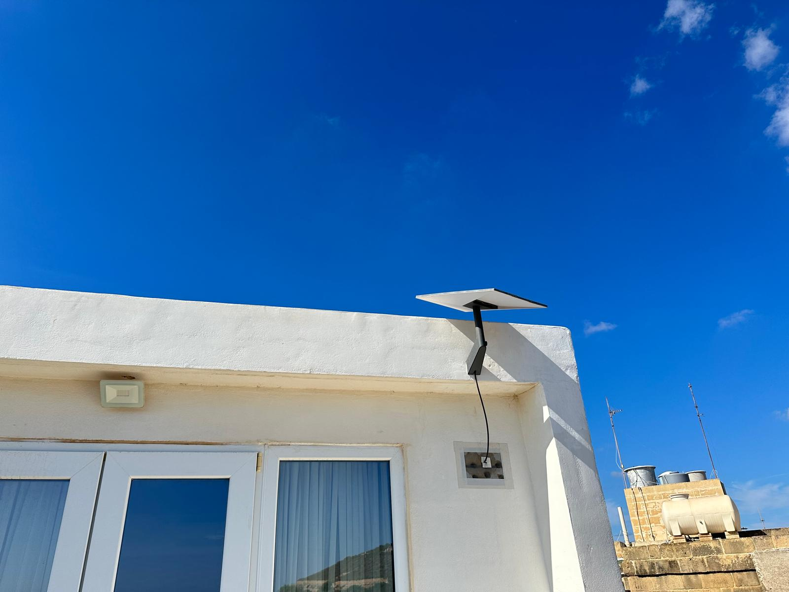

# Project 001 - Wireless, Cellular & RF

A backup connection is only useful if it works where I need it.

After building the physical baseline, I started checking connectivity around my home lab in Gozo, Malta. I tested GO and Epic on the same phone at four locations, took an exploratory look at the local RF spectrum, and recorded separate Melita and Starlink connection paths.

The first measurements are in. Repeatability, building attenuation and end-to-end failover are still work in progress.

## What I found so far

- At the rack, the single download results were 18.81 Mbps on GO and 19.29 Mbps on Epic.
- Outside the house, approximately 5 m in a straight line from the rack, the results were 46.38 Mbps on GO and 102.53 Mbps on Epic.
- Throughput was only part of the picture. At the rack, download-loaded latency reached 1,108 ms on GO and 944 ms on Epic during these tests.
- The RF observations were made at one rack-shelf position. I have not yet mapped the rest of the building.
- Starlink worked as a standalone connection in my recorded work, but its integration as the UDR7 secondary WAN remains unresolved. These are different outcomes.

These are individual observations, not average speeds or a ranking of the two carriers. The next step is to find out how consistently each connection supports actual work.

## Read the project

| Document | Contents |
| --- | --- |
| [Cellular results](docs/01-cellular-results.md) | All eight tests, device, locations, timing, servers and interpretation |
| [Building and placement](docs/02-building-and-placement.md) | Thick walls, the existing room and the next attenuation study |
| [RF observations](docs/03-rf-observations.md) | Initial spectrum notes, setup photo, short video and measurement limits |
| [Wi-Fi, wired internet and Starlink](docs/04-internet-paths.md) | Connection paths, recorded work and unresolved integration |
| [Next measurement plan](docs/05-next-measurement-plan.md) | Repeated runs, averages, other phones, multiple RF locations and service tests |
| [Cellular data CSV](data/cellular-initial.csv) | Transcribed initial results in a reusable format |

## Current state

| Work | State |
| --- | --- |
| GO and Epic, four locations on iPhone 16e | Initial measurements collected; one recorded run per carrier/location |
| RF at the rack | Exploratory observations collected; one location |
| Melita/Starlink Wi-Fi and wired tests | Execution recorded in my build notes; detailed result captures not included here |
| Starlink standalone application result | Approximate result retained in my notes |
| Starlink secondary WAN on UDR7 | Unresolved; failover not validated |
| Repeated cellular runs and averages | Planned |
| Other phone models at the same positions | Planned |
| Multi-location RF and antenna comparisons | Planned |
| Controlled wall attenuation measurements | Planned |
| U7 Pro band, placement and roaming comparison | Deferred to a later test phase |

## How this fits the lab

[Project 000](../project-000-baseline/README.md) covers the physical baseline. Project 001 owns the connectivity and RF observations. Project 002 owns network failure, recovery and the unresolved Starlink secondary-WAN work. Project 003 owns power continuity; a working connection still depends on powered equipment. Travel and cross-city extensions remain Future Backlog, not completed projects.

I use the same operating model across the lab:

`NORMAL -> FAILURE -> DEGRADED -> RECOVER -> VERIFY`

This project establishes starting conditions. It does not yet demonstrate every transition.

Failure is inevitable. Design the resilience.
