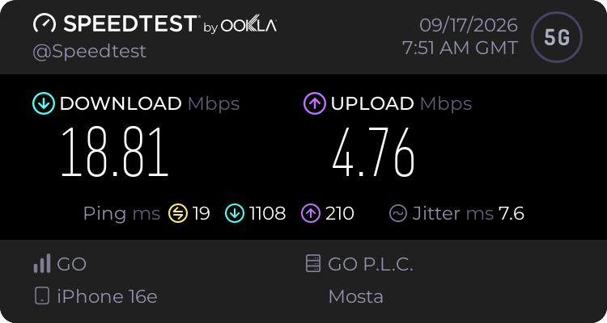
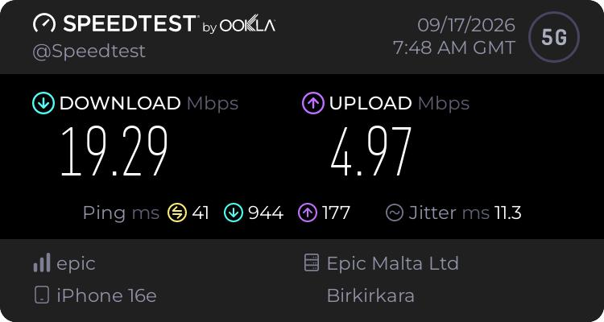
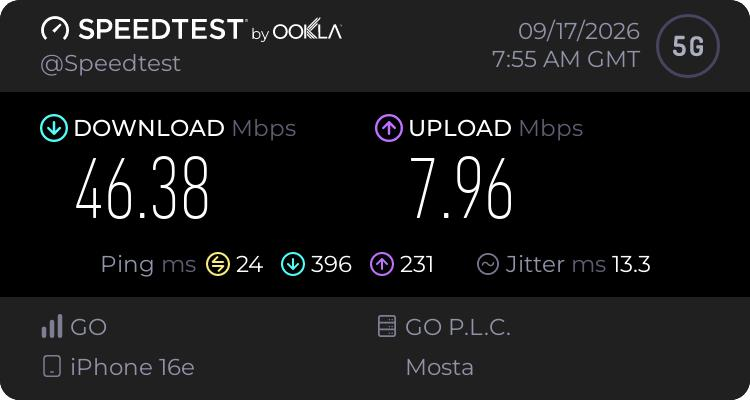
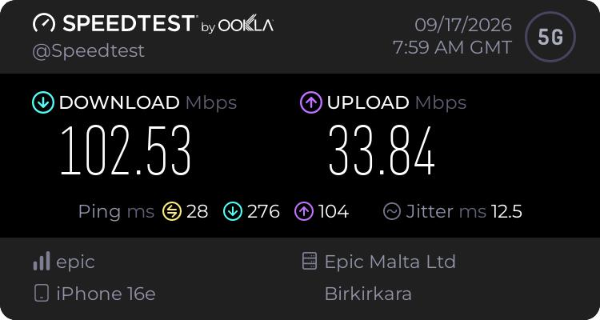
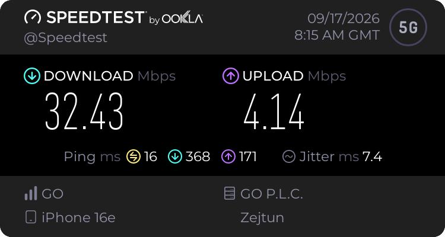
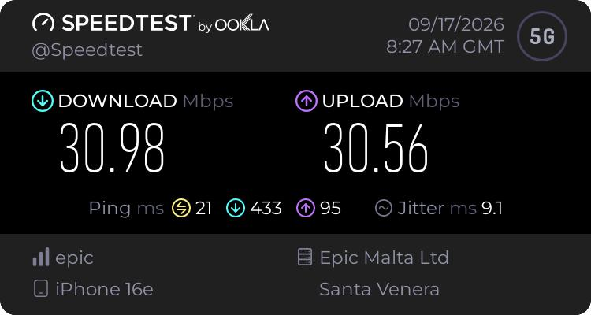

# Initial cellular results

I used an iPhone 16e to test GO and Epic at the rack, outside the house, in the first-floor master bedroom and on the second-floor rooftop. I changed the SIM/eSIM context between carriers and used the same four locations.

The outside point was approximately 5 m from the rack in a straight line. That is a location description, not a measured radio propagation path.

## Results recorded on 17 September 2026

There is one saved result per carrier at each location. Times below retain the GMT label displayed in the screenshots; they are not silently converted to Malta local time. Speeds are Mbps; latency and jitter are milliseconds.

| Location | Carrier | Time (GMT) | Download | Upload | Idle ping | Download-loaded latency | Upload-loaded latency | Jitter |
| --- | --- | --- | ---: | ---: | ---: | ---: | ---: | ---: |
| Rack | GO | 07:51 | 18.81 | 4.76 | 19 | 1108 | 210 | 7.6 |
| Rack | Epic | 07:48 | 19.29 | 4.97 | 41 | 944 | 177 | 11.3 |
| Outside house | GO | 07:55 | 46.38 | 7.96 | 24 | 396 | 231 | 13.3 |
| Outside house | Epic | 07:59 | 102.53 | 33.84 | 28 | 276 | 104 | 12.5 |
| First-floor master bedroom | GO | 08:15 | 32.43 | 4.14 | 16 | 368 | 171 | 7.4 |
| First-floor master bedroom | Epic | 08:06 | 33.48 | 3.51 | 78 | 522 | 277 | 11.4 |
| Second-floor rooftop | GO | 08:23 | 41.50 | 13.96 | 33 | 506 | 88 | 28.4 |
| Second-floor rooftop | Epic | 08:27 | 30.98 | 30.56 | 21 | 433 | 95 | 9.1 |

All eight tests were taken at the four locations around my home in Gozo. The different city names in the screenshots identify the Speedtest servers, not my physical location. The carrier appears on the left; the server operator appears on the right. The GO rooftop test, for example, used an Epic-hosted server.

| Carrier / location | Test server shown |
| --- | --- |
| GO / rack | GO P.L.C. |
| GO / outside | GO P.L.C. |
| GO / bedroom | GO P.L.C. |
| GO / rooftop | Epic Malta Ltd |
| Epic / rack | Epic Malta Ltd |
| Epic / outside | Epic Malta Ltd |
| Epic / bedroom | Epic Malta Ltd |
| Epic / rooftop | Epic Malta Ltd |

## What these runs changed in my thinking

The two rack download results were close, while the outside results were substantially higher for both carriers. That makes placement worth investigating. It does not isolate the walls as the cause: time, network loading, serving cell, band and the phone's radio state could also have changed.

The rooftop was not simply the fastest position. Epic's rooftop upload result was much higher than its rack result, but its highest recorded download was outside the house. GO's highest recorded download was also outside. I need repeated results before choosing a permanent fallback position.

Idle ping alone would have hidden another issue. Both rack tests showed much higher latency during download load. That matters for calls, remote sessions and interactive work, so the next phase will test those activities under load. These runs do not locate the bottleneck or prove a particular queueing fault.

## Limits of this first pass

- One run per carrier/location cannot describe normal variability, an average, or worst-case service.
- Tests were sequential, not simultaneous. Carrier pairs were separated by 3 to 9 minutes, and the overall session ran from 07:48 to 08:27 GMT.
- Test endpoints differed, including within each carrier's results. Internet routing and server conditions are part of the result.
- I did not collect RSRP, RSRQ, SINR, cell identifiers or band information. The displayed 5G icon is not a radio-quality measurement.
- Exact phone orientation, height, background traffic, thermal state and door/window state were not fully logged for this session.
- A result from the phone does not establish laptop tethering performance or router-integrated failover.
- No sustained outage, long-duration availability or packet-loss study was performed in these eight runs.

I will keep these original results and add repeated measurements alongside them, rather than replace them with a cleaner-looking average.

## Saved screenshots

### Rack

### Outside house

### First-floor master bedroom

### Second-floor rooftop

