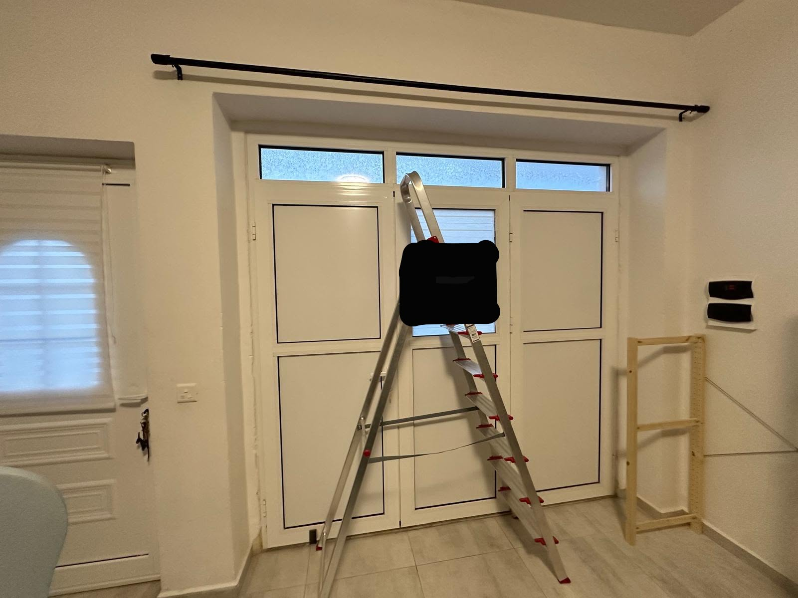

# Building and placement

The lab is in an existing residential space in Gozo, Malta. The house has thick walls, including internal sections, which are an important part of the environment I am testing.

My approximate dimensions for this property are 20-30 cm for the external wall sections and 40-50 cm at thicker pier/frame-like sections, including some internal sections. These are local estimates, not standard dimensions for every Maltese or Gozitan house. I have not yet made a systematic wall-by-wall survey or verified each section's internal construction.

## The existing room

The space was originally built as a garage. It was already being used as a room before I set up the lab; I did not carry out the garage-to-residential conversion. My work was to reorganize and equip the existing room as the lab described in Project 000.

The photograph shows the broad existing opening with its PVC panel/frame assembly leading outside, and the surrounding wall depth. That opening is part of the test environment, not just background scenery. I will record whether doors and windows are open or closed when I repeat nearby measurements.

## What I want to test next

I want to understand how location, wall sections, openings and floor changes relate to usable connectivity. For each test position I will record height, orientation, nearby metalwork and the approximate intervening construction, then repeat measurements on both sides of selected sections where practical.

A speed difference will remain a throughput observation. I will not label it a measured wall loss in dB. A more controlled attenuation test needs a stable source, consistent receiver and antenna setup, documented geometry and repeated reference measurements. For cellular service, the serving network can change between observations, so I will also collect radio metrics where the device makes them available.

The current results make the building worth investigating; they do not yet quantify its attenuation.
