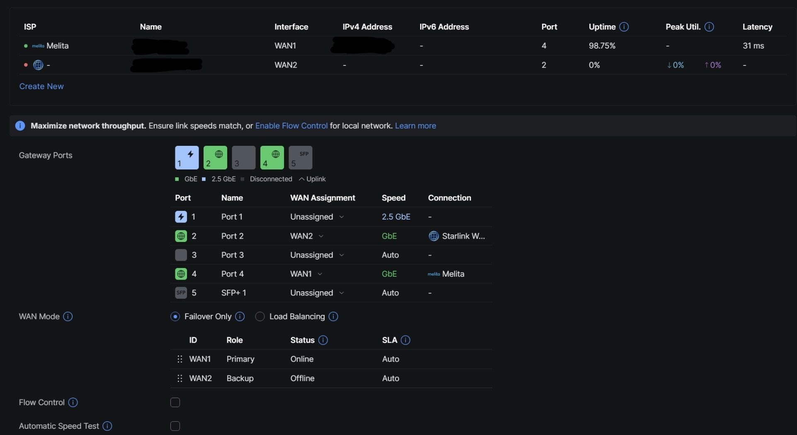

# Project 002 - Network Failure & Recovery

The management screen came back after 3 minutes 50 seconds. The camera was still flashing white.

At 5 minutes 22 seconds, its LED turned blue. I had two recovery observations, but I still did not have a measured time for the live video to return.

This is the next stage of my home resilience lab in Gozo, Malta: testing what happens when the router restarts, and finding out whether a backup connection is actually usable by the network.

## What happened

I restarted the UDR7 through its management interface while running a continuous ping from an Ethernet-connected PC. I used a stopwatch to record the management screen returning and a CCTV LED changing state. Both times start from the same moment: pressing the final confirmation to restart.

I also tried to integrate Starlink as the backup WAN. Starlink provided internet directly to a laptop, but remained offline as the UDR7 secondary WAN. That integration is unresolved in this record.

## Results at a glance

| Observation | Result | State |
| --- | --- | --- |
| UDR7 management screen returned | Approximately T+3:50 | Manually observed |
| CCTV LED changed from flashing white to blue | Approximately T+5:22 | Manually observed, same start point |
| Ping session | 366 sent, 350 received, 16 lost; 4% reported loss | Whole-session summary retained |
| Exact internet interruption | Not established | Timestamped measurement still needed |
| Exact CCTV live-video restoration | Not measured | LED observation only |
| Starlink direct Ethernet to laptop | Internet access observed | Standalone path worked |
| Starlink through UDR7 WAN2 | Offline in the recorded attempt | Unresolved; failover not validated |
| Phone joined saved Starlink Wi-Fi during reboot | Automatic client reconnection observed | Separate from router WAN failover |

The useful result was learning to separate the management screen, packet replies, device indicators and actual services. Each answers a different recovery question.

## Read the work

- [The reboot test](docs/01-reboot-observations.md): method, manual timing, ping results and the limits of the first run.
- [The Starlink WAN attempt](docs/02-starlink-wan-attempt.md): working standalone connection, configuration, port changes and the unresolved outcome.
- [What I will test next](docs/03-next-tests.md): timestamped recovery measurements, service checks and deferred fallback paths.

## Network context

Melita is the recorded working primary path into the UDR7. The UDR7 connects to the USW-Pro-Max-16-PoE core switch, with downstream access point, camera and other lab devices. Starlink is the intended second WAN; it is not a verified working backup through this router.

The WAN screenshot shows Melita assigned to port 4 and Starlink WAN2 assigned to port 2, with Failover Only selected. A backup assignment is part of the configuration, not evidence that traffic can use it.

## Later cross-project observation

During a later Project 003 power-continuity session, Internet connectivity was found to be unavailable.

The exact onset time of the connectivity loss was not established.

The cause of the WAN interruption was not established. The available observations do not distinguish between the ISP path, UDR7 WAN state, another upstream network condition, or an event coincident with the power test.

Working Internet access was restored using a direct Starlink Ethernet connection. This was a manual fallback path and does not validate Starlink failover through the UDR7.

The power-test context and evidence are recorded in [Project 003 - Power Continuity Tests](../project-003-power-continuity/docs/03-power-continuity-tests.md) and [Commissioning Blockers and Incidents](../project-003-power-continuity/docs/04-commissioning-blockers-and-incidents.md).

## Related projects

[Project 000](../project-000-baseline/README.md) covers the physical baseline. [Project 001](../project-001-wireless-cellular-rf/README.md) owns connectivity performance and standalone path observations. Internet speed results will be expanded there alongside plan details and connection methods.

Project 002 owns network interruption and recovery. Project 003 owns power continuity, with shutdown and restart dependencies shared between the two. Configuration recovery, segmentation and further standby arrangements remain future work.

`NORMAL -> FAILURE -> DEGRADED -> RECOVER -> VERIFY`

The initial reboot test established a partial recovery sequence, while the later Project 003 incident reinforced the need to separate local network continuity, WAN availability and fallback-path usability.

The next tests will focus on timestamped service recovery and validating whether the intended secondary WAN can actually carry traffic through the UDR7.

Failure is inevitable. Design the resilience.
