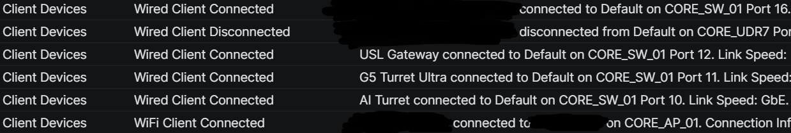

# The reboot test

I wanted to see what would happen to the lab when its central router restarted. This was a restart requested through the UDR7 management interface, not a power-cut test.

## Method

I connected the test PC through Ethernet and ran a continuous Windows ping:

```bat
ping 1.1.1.1 -t
```

The address above is the external test destination, not the lab's WAN address.

I started my stopwatch when I pressed the final confirmation in the restart dialog. I watched the UniFi management screen and the CCTV status light, recording the observed transitions manually. The camera time was a cumulative reading from the same start point, not an additional interval after the management screen returned.

## Manual observations

| Time from final restart confirmation | Observation |
| --- | --- |
| T+0 | Restart confirmed; stopwatch started |
| Approximately T+3:50 | The Restarting loading screen disappeared and the normal management screen returned |
| After the management screen returned | The observed camera was still flashing white |
| Approximately T+5:22 | The camera LED changed to blue; I pressed the stopwatch lap button |

These are human observations with manual stopwatch operation. They include reaction time and do not provide millisecond precision. The observation applies to the camera I watched, not a measured recovery time for every camera in the lab.

I did not independently time the first usable live-video frame. The blue light is the event I recorded; it is not a substitute for opening the live view and checking the image.

## Ping results retained from the session

| Metric | Recorded result |
| --- | ---: |
| Packets sent | 366 |
| Packets received | 350 |
| Packets lost | 16 |
| Loss reported by the terminal | 4% |
| Minimum reported round-trip time | 26 ms |
| Maximum reported round-trip time | 57 ms |
| Average reported round-trip time | 32 ms |

The retained notes describe occasional timeouts, a short burst of timeouts, a `Destination net unreachable` message and later replies from the test destination. The table preserves the terminal's reported summary; it is not a reconstructed line-by-line log. A terminal screenshot and complete raw output are not included in this record.

The output was not timestamped and did not have a restart marker aligned with its individual lines. The stopwatch has a defined start point, but I cannot synchronize it precisely with each ping result afterwards.

Consequently, the 4% is a statistic for the whole session. I cannot attribute all 16 losses to the reboot, calculate an exact outage from the packet count, or interpret the management screen's 3:50 return time as a 3:50 internet outage. The reported round-trip figures also do not include a measured duration for timed-out requests.

## Device connection events



This excerpt shows wired client connection/disconnection events and connection entries for a gateway, cameras and a Wi-Fi client. It helps document the types of events available in the management system.

The excerpt has no visible event timestamps. I cannot place these entries on the stopwatch timeline or treat the order displayed here as a verified reboot recovery sequence. In the repeat test I will retain timestamps and the surrounding events.

## What I learned

There are several separate questions to answer before I can call the network recovered:

| Layer | What this run recorded | What I still need |
| --- | --- | --- |
| Management interface | Screen returned at approximately 3:50 | Correlation with the other measurements |
| Internet packet replies | Session summary and reported return of replies | Timestamped loss and sustained recovery |
| Downstream device state | One camera's LED changed at approximately 5:22 | Separate observations for each selected device |
| Actual services | No timed live-video check | Browser, DNS, live view and other essential service checks |

The management screen and the camera indicator returned at different times. That is enough to change my next test: I will measure each selected service directly instead of using one visible sign as the recovery time for the whole lab.

## Phone fallback

During the reboot, my phone automatically joined its separately saved Starlink Wi-Fi. This was a client-side reconnection to another available wireless network.

I did not record its transition time or a timed application check in this run. It does not demonstrate that the UDR7 switched WANs, that existing sessions survived, or that the other lab clients recovered through Starlink.
