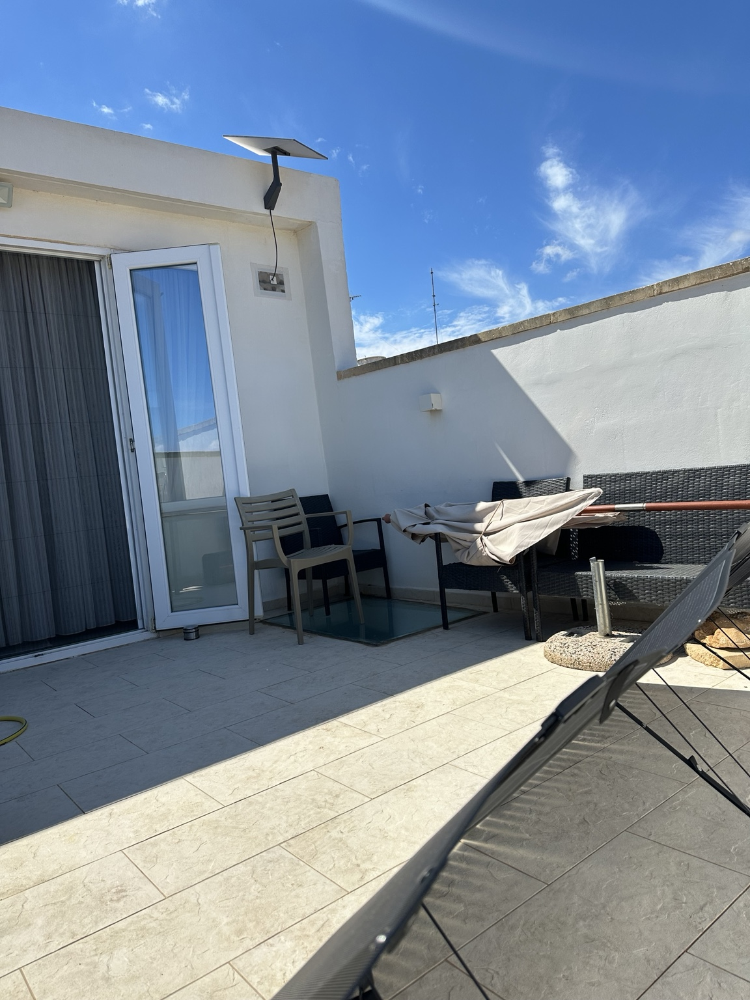
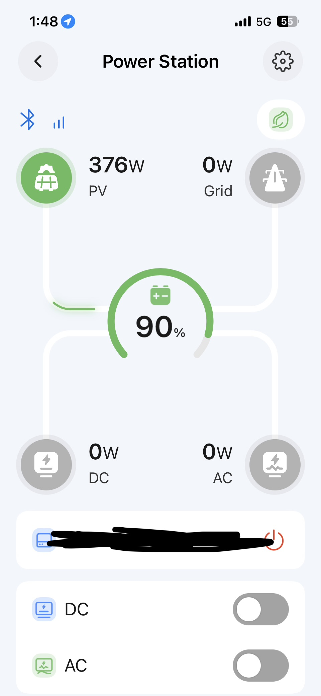
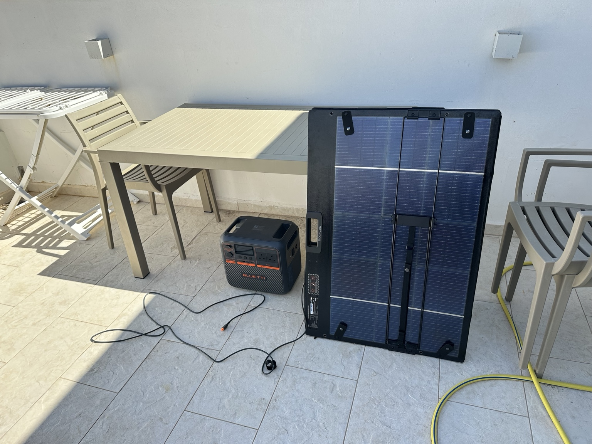

# Solar charging baseline

[Back to Project 003](../README.md)

The first question was straightforward: could the portable panel provide usable input to the power station in the arrangement I had available?

I used an EcoFlow 400W Portable Solar Panel and a BLUETTI Elite 200 V2 power station on the terrace. This was an initial charging observation on 17 September 2026. I did not connect the UPS, generator or lab equipment for a continuity test.

## Equipment

- Solar panel: EcoFlow 400W Portable Solar Panel
- Power station: BLUETTI Elite 200 V2
- Thermal camera: Testo 860i
- Phone: Apple iPhone 16e

## Setup

The panel was unfolded on its supports outdoors. The power station was positioned under the terrace table, in shade in the recorded views. The photographs show direct sunlight and some cloud; I did not measure irradiance, wind or ambient air temperature.

The connection ran from the panel through its cable connection to the BLUETTI DC/PV input. I recorded both the cable connection and the input area in the [thermal observations](02-thermal-observations.md). I did not record a measured cable length or perform a controlled cable-length comparison in this run.

The saved application captures show no grid input and no AC or DC output. That gives this run a narrow scope: observing solar input and the battery's displayed state of charge.

## Recorded configuration

Before the solar run, I captured the application settings:

- Working mode: Standard UPS
- Charging mode: Standard
- Power Lifting: off
- Visitor Access: off
- Default Connection Mode: Cloud
- Screen Timeout: 1 min
- Carbon Emission Factor: 0.959

[Connection and access settings](../media/app/connection-settings.jpg) / [Working and charging settings](../media/app/working-settings.png)

The early dashboard captures show the cloud connection icon. The charging captures show Bluetooth. The mode change matters when interpreting the early zero-input screens: I did not separately measure application refresh delay, so a displayed zero does not establish the exact moment the electrical connection changed.

Standard UPS was a configuration setting in this run. I did not test transfer behavior or continuity merely by selecting that mode. The green leaf icon is visible on the dashboard, but the detailed ECO thresholds are not part of this record.

## Input and SOC record

Times below follow the phone clock, with the afternoon readings written in 24-hour format. They identify saved captures, not exact connection or disconnection events. Separate readings within the same minute are retained separately.

| Time | PV input | SOC | Connection shown | Capture |
| --- | --- | --- | --- | --- |
| 10:54 | 0 W | 87% | Cloud | [Initial dashboard](../media/app/dashboard-1054.jpg) |
| 10:56 | 0 W | 87% | Cloud | [Dashboard after settings](../media/app/dashboard-1056.jpg) |
| 13:29 | 0 W | 87% | Cloud | [Capture](../media/app/solar-1329.jpg) |
| 13:31 | 0 W | 87% | Cloud | [Capture](../media/app/solar-1331.jpg) |
| 13:36 | 349 W | 87% | Bluetooth | [Capture](../media/app/solar-1336.jpg) |
| 13:37 | 355 W | 87% | Bluetooth | [Capture](../media/app/solar-1337.jpg) |
| 13:41 | 365 W | 88% | Bluetooth | [First capture](../media/app/solar-1341-a.jpg) |
| 13:41 | 362 W | 88% | Bluetooth | [Second capture](../media/app/solar-1341-b.jpg) |
| 13:48 | 376 W | 90% | Bluetooth | [Capture](../media/app/solar-1348.jpg) |
| 14:14 | 366 W | 96% | Bluetooth | [Dashboard](../media/app/solar-1414.jpg) |
| 14:14 | 369 W | 96% | Bluetooth | [Charging estimate overlay](../media/app/charging-estimate-1414.png) |
| 14:19 | 0 W | 97% | Bluetooth | [Final capture](../media/app/solar-1419.jpg) |

Grid input and AC/DC output display 0 W throughout these readings.

The application also estimated 41 minutes remaining at 13:41, with SOC at 88%, and 12 minutes at 14:14, with SOC at 96%. These are application estimates based on the charging conditions at that moment. I did not continue to a recorded 100% charge to test their accuracy.

[13:41 charging estimate](../media/app/charging-estimate-1341.jpg)

## What the run established

Usable solar input appeared in the application and the battery's displayed SOC increased. The saved charging readings range from 349 W to 376 W. The final display is 97%, compared with the initial 87%, an increase of 10 percentage points.

The 13:36 and 14:14 captures are 38 minutes apart. That is a span between observations, not a precisely measured charging duration. I did not record a synchronized connection event or continuous input log.

The folded-panel photograph records the packed-down arrangement, with the orange-ended connector disconnected. The final application capture shows 0 W PV input. I have not assigned an exact disconnection time from those two records.

## Limits of this first run

This was one session at one location. I did not control panel angle, measure irradiance or repeat the run under matched conditions. The 400 W figure is the panel's nominal rating; 376 W is the highest saved reading in this record, not a measured session peak or a maximum-capability result.

The captures are unevenly spaced and include multiple readings in the same minute. Averaging them would not produce a reliable time-weighted average. I have not calculated total harvested energy, charge efficiency or stored watt-hours from these snapshots or from the rounded SOC display.

The power readings come from the BLUETTI application. There was no independent voltage/current logging for comparison. The charging path also says nothing yet about AC output under load, UPS compatibility or recovery when an upstream source disappears.

## What I will improve

For the next solar run, I will record the exact equipment labels, cable route and length, panel orientation and tilt, starting SOC and observation conditions. I will mark connection and disconnection times and keep one application connection method throughout the run.

I will log input power and SOC at a fixed interval, preferably with continuous logging if available. Repeated runs under documented conditions will let me report averages, ranges and variation with the sampling method stated. Any energy total will need an appropriate log or meter rather than a few selected screenshots.

The next thermal comparison will use the same surface locations, camera settings and viewing geometry, with ambient conditions recorded. After establishing output and UPS compatibility separately, I will add a defined load to investigate whether useful power remains available while the input changes.
