# Thermal observations during the solar work

[Back to Project 003](../README.md)

I used a Testo 860i with an Apple iPhone 16e to look at the power station, cable connection, DC/PV input area and panel surface. Each thermal view is paired with a visual image of the same scene.

This first set records surface observations. It does not establish internal battery temperature or a pass/fail temperature limit for the equipment.

## Recorded spot temperatures

The temperatures below are the displayed crosshair readings. The scale beside each image covers the wider scene; its upper value is not automatically the temperature of the component being discussed. The view numbers are identifiers, not a test timeline.

| View | Area at the displayed measurement point | Spot temperature |
| --- | --- | --- |
| 1 | Power station, front casing | 37.0 C |
| 2 | Cable connection area | 37.0 C |
| 3 | Power station, front/input-side area | 36.5 C |
| 4 | Power station, side casing | 35.8 C |
| 5 | DC/PV input connection area, closer view | 38.5 C |
| 6 | Solar panel surface | 58.9 C |

### 1. Power station, front view

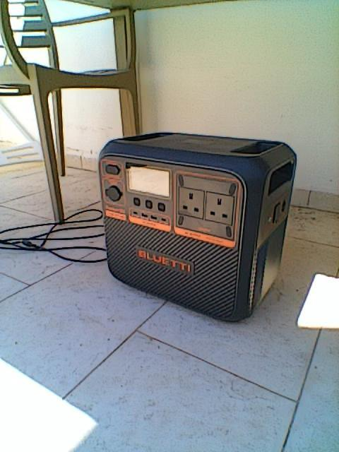

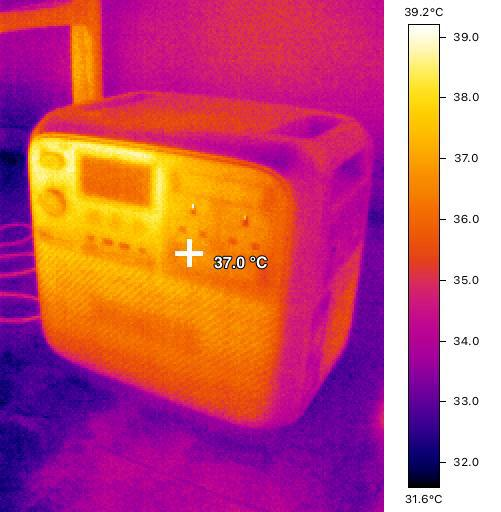

The power station is under the terrace table. The crosshair reads 37.0 C on the front casing in this view.

### 2. Cable connection

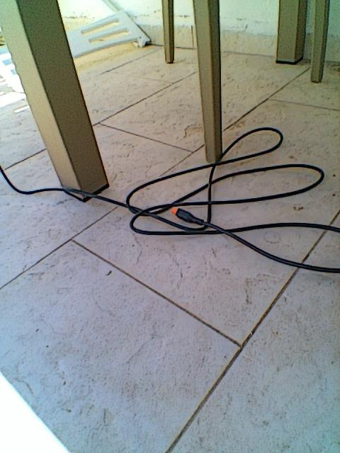

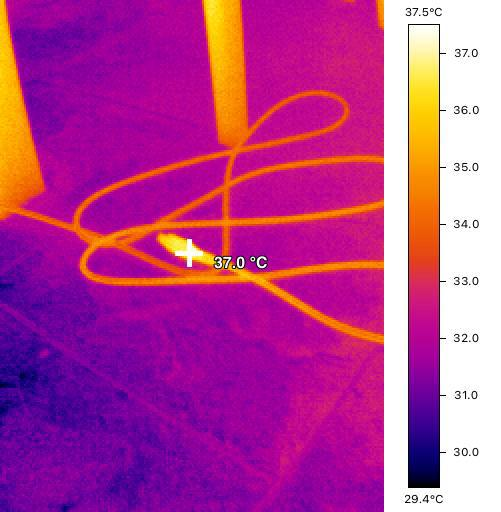

The connection area reads 37.0 C at the displayed point. This observation does not isolate contact resistance or distinguish electrical heating from the surrounding conditions.

### 3. Front and input-side area

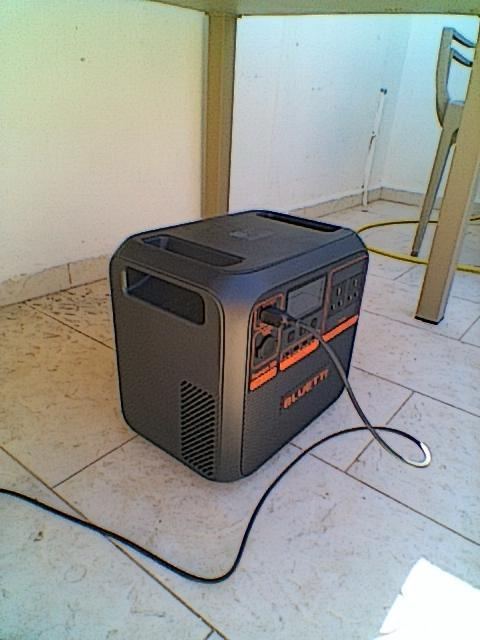

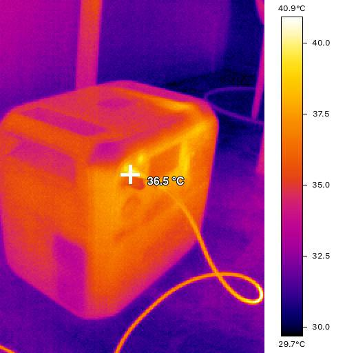

This wider view records 36.5 C near the front input area. It is a different viewpoint from the closer connection view below.

### 4. Side casing

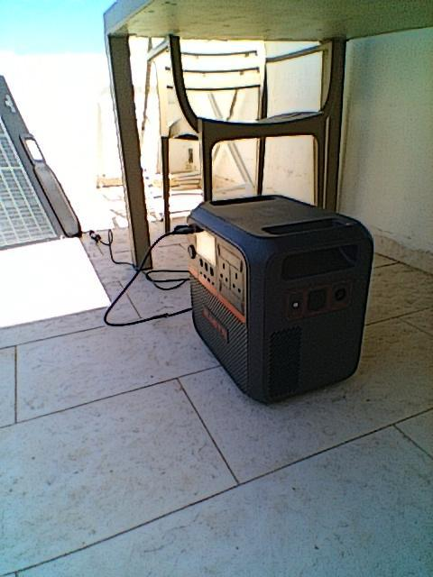

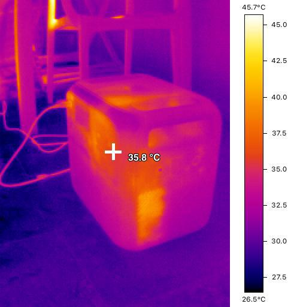

The crosshair reads 35.8 C on the casing. Other objects in the frame contribute to the image's wider temperature scale.

### 5. DC/PV input connection

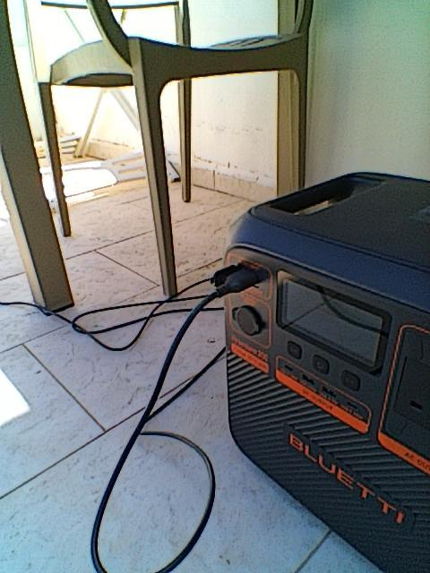

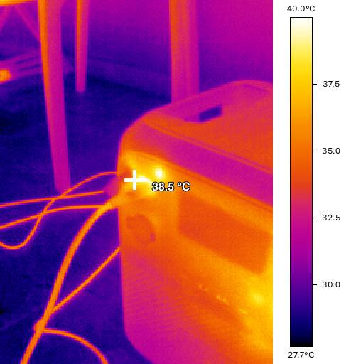

The displayed point near the input connection reads 38.5 C. I have not treated the difference from view 3 as a measured temperature rise: the position and angle differ, and these exported views are not linked to a synchronized test clock.

### 6. Panel surface

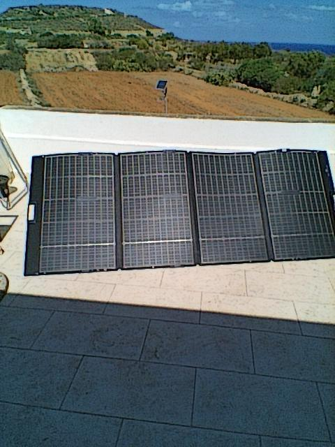

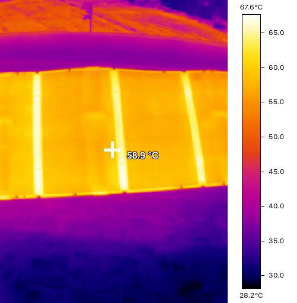

The panel surface reads 58.9 C at the crosshair. The panel and the shaded power station were in different exposure conditions. Their temperatures are not directly comparable as a measure of electrical loss or cooling performance.

## How I will use these observations

The images give me locations to revisit: the cable joint, the input connection and repeatable points on the enclosure and panel. They do not justify a general claim of no overheating or a completed electrical-safety test.

I have not recorded a matched before/after sequence for these exact points. Emissivity, reflected-temperature settings, distance, ambient conditions and surface reflections were not documented alongside these exports, which limits quantitative comparison. Colors also cannot be compared directly across images because their scales differ.

For the next run, I will mark consistent measurement locations, record camera settings and ambient conditions, and take readings before charging and at fixed intervals. I will connect each capture to input power, SOC and the test clock. That will make the next record useful for comparing changes at the same point rather than comparing unrelated surfaces.
